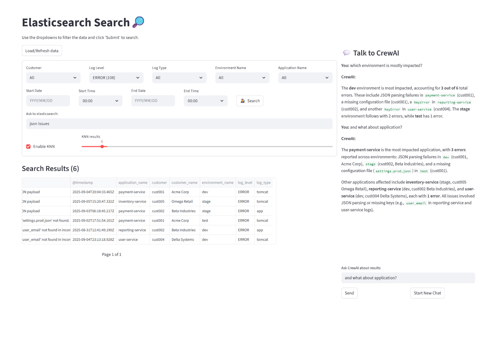

# Talk to Logs: Streamlit App (`ui_main.py`)

## Overview

This Streamlit application provides an interactive interface to query, analyze, and visualize logs ingested from an ELK (Elasticsearch, Logstash, Kibana) stack. It leverages advanced retrieval-augmented generation (RAG) techniques and integrates with ElasticSearch to enable natural language querying of log data. The app is designed for observability, troubleshooting, and log intelligence use cases.

---

## Table of Contents

- [Features](#features)
- [Architecture & Workflow](#architecture--workflow)
- [Module Explanations](#module-explanations)
  - [ui_main.py](#ui_mainpy)
  - [ui_agentic_backend.py](#ui_agentic_backendpy)
  - [ui_utils_backend.py](#ui_utils_backendpy)
  - [config.py](#configpy)
  - [elastic_MCP_demo.py](#elastic_mcp_demopy)
- [Configuration](#configuration)
- [How to Run](#how-to-run)
- [Dependencies](#dependencies)
- [Screenshots](#screenshots)
- [Troubleshooting](#troubleshooting)

---

## Features

- **Natural Language Log Querying:** Ask questions about your logs in plain English.
- **ElasticSearch Integration:** Connects to your ELK stack for real-time log retrieval.
- **RAG (Retrieval-Augmented Generation):** Combines search and LLMs for context-aware answers.
- **Interactive UI:** Built with Streamlit for easy use and visualization.
- **Agentic Backend:** Modular backend for handling queries, context, and responses.

---

## Architecture & Workflow

1. **User Interaction:**  
  The user enters a natural language query in the Streamlit UI.

2. **Query Processing:**  
  The query is sent to the backend (`ui_agentic_backend.py`), which orchestrates the retrieval and response generation.

3. **Log Retrieval:**  
  The backend uses ElasticSearch APIs (configured in `config.py`) to search relevant logs based on the query.

4. **RAG Pipeline:**  
  Retrieved log snippets are passed to a language model (LLM) to generate a context-aware answer.

5. **Response Display:**  
  The answer, along with supporting log evidence, is displayed in the Streamlit UI.

6. **Utilities:**  
  Helper functions in `ui_utils_backend.py` handle formatting, error handling, and additional UI features.

---

## Module Explanations

### `ui_main.py`

- **Purpose:**  
 The main entry point for the Streamlit app. Handles UI layout, user input, and output display.
- **Key Functions:**
  - Initializes the Streamlit page and sidebar.
  - Collects user queries.
  - Calls backend functions to process queries.
  - Displays results, logs, and visualizations.
- **Imports:**
  - `streamlit` for UI components.
  - `ui_agentic_backend` for backend logic.
  - `ui_utils_backend` for utility functions.
  - `config` for configuration parameters.

### `ui_agentic_backend.py`

- **Purpose:**  
 Contains the core logic for handling user queries, interacting with ElasticSearch, and orchestrating the RAG pipeline.
- **Key Functions:**
  - `process_query(query)`: Main function to process user input.
  - `search_logs(query)`: Searches ElasticSearch for relevant logs.
  - `generate_response(logs, query)`: Uses an LLM to generate an answer based on logs.
- **Integration:**  
 Uses configuration from `config.py` and utility functions from `ui_utils_backend.py`.

### `ui_utils_backend.py`

- **Purpose:**  
 Provides utility functions for formatting, error handling, and UI enhancements.
- **Key Functions:**
  - `format_logs(logs)`: Formats log entries for display.
  - `display_error(message)`: Shows error messages in the UI.
  - Additional helpers for data processing and visualization.

### `config.py`

- **Purpose:**  
 Centralizes all configuration parameters for the app.
- **Key Configurations:**
  - `ELASTICSEARCH_HOST`: URL of the ElasticSearch instance.
  - `ELASTICSEARCH_PORT`: Port number for ElasticSearch.
  - `INDEX_NAME`: Name of the log index in ElasticSearch.
  - `LLM_API_KEY`: API key for the language model (if using an external LLM).
  - Other parameters: timeouts, authentication, etc.
- **Usage:**  
 All modules import from `config.py` to ensure consistent configuration.

### `elastic_MCP_demo.py`

- **Purpose:**  
 Demonstrates the use of the Model Context Protocol (MCP) for integrating LLMs with ElasticSearch.
- **Key Functions:**
  - Example scripts for running RAG pipelines.
  - May include sample queries and output.

---

## Configuration

All configuration is managed in `config.py`.  
**Example:**

```python
ELASTICSEARCH_HOST = "localhost"
ELASTICSEARCH_PORT = 9200
INDEX_NAME = "logs"
LLM_API_KEY = "your-llm-api-key"
```

- Update these values to match your ELK stack and LLM provider.
- Ensure your ElasticSearch instance is running and accessible.

---

## How to Run

1. **Install Dependencies:**

    ```bash
    pip install -r requirements.txt
    ```

2. **Configure the App:**

    - Edit `config.py` with your ElasticSearch and LLM details.

3. **Start the Streamlit App:**

    ```bash
    streamlit run ui_main.py
    ```

4. **Open in Browser:**

- The app will open at `http://localhost:8501` by default.

---

## Dependencies

- `streamlit`
- `elasticsearch`
- `openai` or other LLM SDK (if using external LLM)
- `pandas`, `numpy` (for data processing)
- See `pyproject.toml` or `requirements.txt` for full list.

---

## Screenshots

Below is a screenshot of the Streamlit UI:



---

## Troubleshooting

- **ElasticSearch Connection Errors:**  
 Ensure ElasticSearch is running and the host/port in `config.py` are correct.

- **LLM API Errors:**  
 Check your API key and network connectivity.

- **Log Index Not Found:**  
 Verify the `INDEX_NAME` matches your ElasticSearch index.

- **Other Issues:**  
 Check logs and error messages in the Streamlit UI for details.

---

## Contact

For questions or support, please refer to the project maintainer or open an issue.

---
